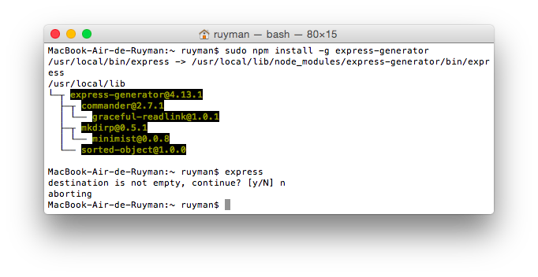
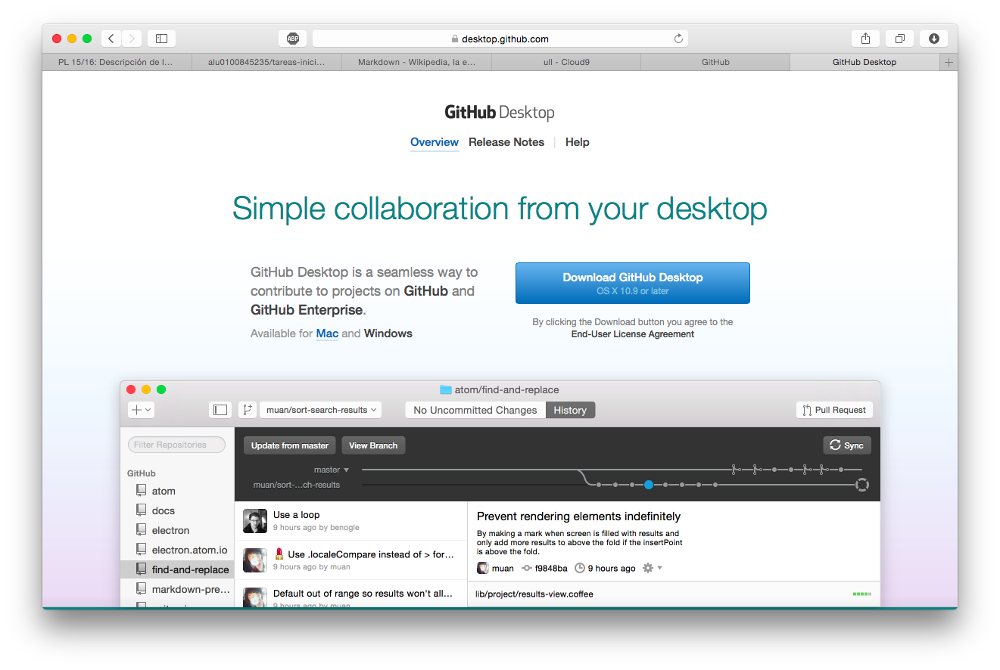
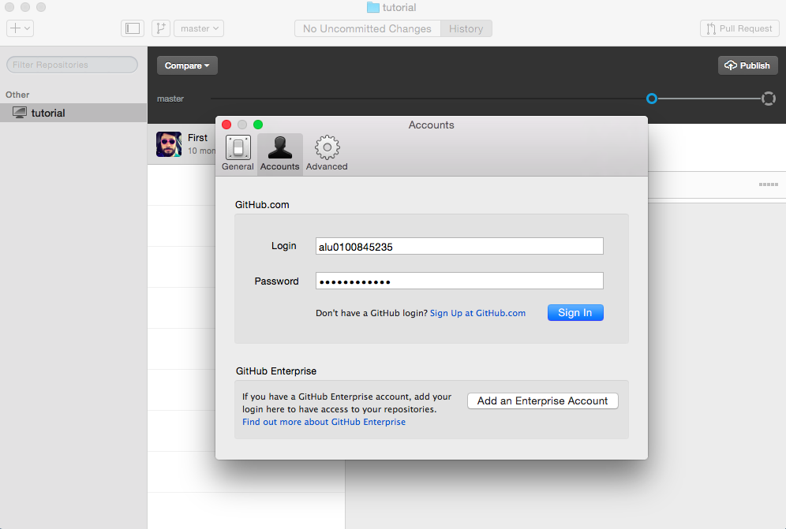
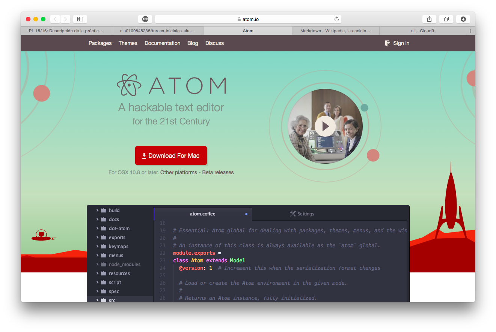

#Tutorial de instalación de NodeJS, Express, Atom, GitHub, Cloud9 y Markdown en MacOSX

## Instalación de NodeJS

1. Descargamos el instalador desde la web https://nodejs.org/en/
2. Una vez descargado procedemos a las instalación.
3. Por último, abrimos un Terminal y escribimos node.

 


## Instalación de Express (Necesario tener NodeJS instalado)

1. Abrimos un Terminal y ejecutamos los siguientes comandos:
    * sudo npm install -g express
    * sudo npm install -g express-generator
2. Ahora comprobamos que este correctamente instalardo ejecutando express.




## Instalación de GitHub Desktop

1. Descargamos el instalador desde la web https://desktop.github.com
2. Opcionalmente, movemos el archivo descargado a la carpeta de Aplicaciones
3. Ejecutamos la aplicación y iniciamos sesión con nuestro usurio de GitHub.

 


## Instalación del editor de texto Atom

1. Descargamos el instalador desde la web https://atom.io
2. Opcionalmente, movemos el archivo descargado a la carpeta de Aplicaciones
3. Ejecutamos la aplicación.




## Instalación del paquete Emmet para Atom

1. Abrimos Atom y navegamos por el menú Atom - Preferences - Packages
2. En el campo de busqueda que sale en la ventana derecha escribimos emmet
3. En el resultado, con el paquete de emmet hacemos click en instalar.


## Instalación del Pandoc

1. Descargamos el instalador desde la web http://pandoc.org
2. Instalamos el paquete descargado.
3. Ejecutamos el siguiente comando en el terminal: pandoc --help


## Cloud 9

Es un IDE de desarrollo online, para su uso será necesario crear una cuenta en la página oficial o acceder con las credenciales de GitHub si ya se dispone de una cuenta. Una vez registrados podremos crear proyectos de varias tecnologías como puede ser NodeJS, HTML5, C++, Ruby On Rails, etc.

[](images/cloud.png)

Si disponemos de algún proyecto en un repositorio de GitHub podremos asociarlo a **Cloud9** para trabajar en él tan solo creando un “`nuevo workspace`” y añadiendo la url *git* del correspondiente repositorio.

[](images/cloud2.png)

Además **Cloud9** permite el trabajo en equipo en el IDE añadiendo miembros a tu workspace.

## Markdown

Markdown es un lenguaje de marcado ligero, lo vamos a utilizar en el editor de texto Atom ya que incorpora por defecto este formato y podremos obtener un live preview mientras vamos desarrollando además de poder exportarlo a HTML sin la necesidad de usar un conversor adicional.

Sintaxis:


Encabezados
```
# Encabezado H1
## Encabezado H2
### Encabezado H3
```
Tipografía
```
**Negrita**
*Cursiva*
> Citas
Parrafo separar por lineas en blanco
`Codigo`
```
Recursos
```

* [Links](https://example.com)
```
Listas
```
1. Lista 1
2. Lista 2

* Lista 1
* Lista 2
```

**Recursos:**

* [NodeJS](https://nodejs.org)
* [Express](http://expressjs.com)
* [Atom IDE](https://atom.io)
* [GitHub Desktop](https://desktop.github.com)
* [GitHub Pages](https://pages.github.com/)
* [Cloud 9 IDE](https://c9.io)
* [Markdown](http://daringfireball.net/projects/markdown/)
* [Resultado del Markdown HTML](http://alu0100536652.github.io/Tutorial-STW/)
